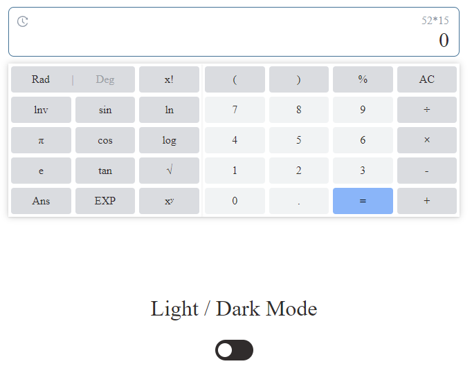
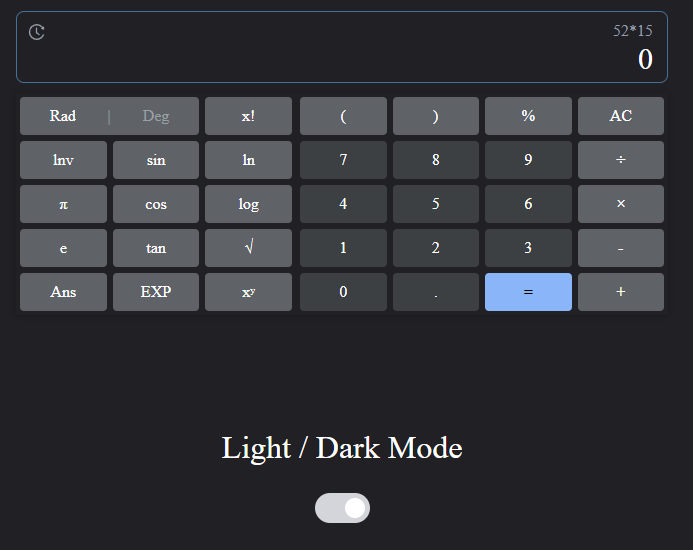
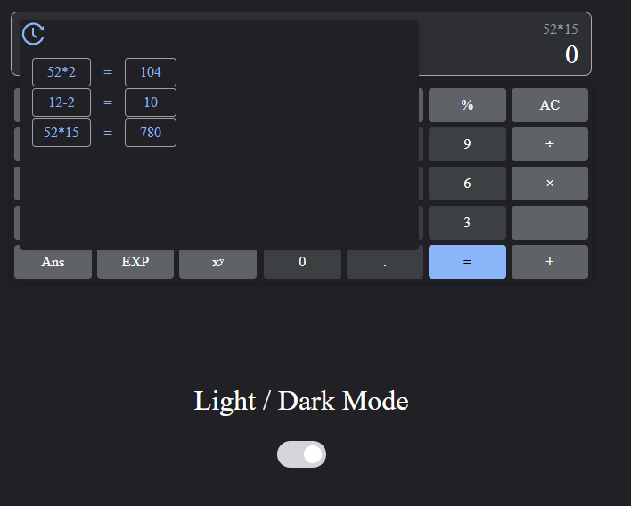

# Google Calculator Clone /w React

I cloned google calculator and simple operations 


## Used technologies

 React, React-Icons, Sass


## Screenshots

You can view the screenshots or watch the <a href ="https://www.youtube.com/watch?v=KTWT0nSqTnk">video</a> below.






## Run it on your computer

Clone the project

```bash
  git clone https://github.com/CihatKOCAK/google-calculator-react.git
```

```bash
  cd google-calculator-react
```

Install required packages and run

```bash
  yarn; yarn start
```
or
```bash
  npm i; npm start
```

